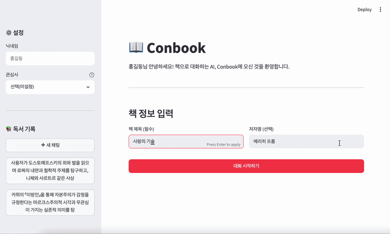
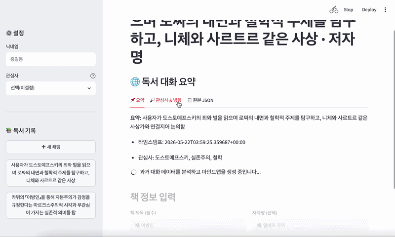

# 📚 Conbook

Conbook은 대화 내용을 저장하고, 그 안에서 insight를 뽑고, 마지막에 화면으로 보여주는 프로젝트입니다.
 




---


## ✨ 주요 기능

| 기능 | 설명 |
|------|------|
| 맞춤형 독서 대화 | 사용자의 관심사와 목표에 맞춰 AI가 질문 방향을 조정 |
| 5가지 핵심 액션 | 줄거리 정리 / 해석 / 토론 / 독후감 / 인사이트 추출 원클릭 실행 |
| 마인드맵 시각화 | 이전 독서 대화를 계층형 트리로 한눈에 파악 |
| 인사이트 파이프라인 | 발화 흐름 분석으로 핵심 키워드·방향성 자동 요약 |
| 세션 저장 및 관리 | JSONL 포맷으로 대화를 엔티티 단위로 저장·불러오기 |


### 🎨 창의성 
>기존 서비스(노션, 왓챠, 밀리의 서재 등)는 대화가 끝나면 내용이 휘발됩니다. Conbook은 대화 속 인지적 흐름을 추적해 '생각이 어떻게 변해갔는가'를 구조화합니다. 

### ⚙️ 구현 난도
>단순 챗봇을 넘어 summary / interests / direction 3중 JSON 스키마로 발화 데이터를 구조화하고, pyvis 기반 마인드맵 시각화와 인사이트 파이프라인을 Streamlit 위에서 통합 구현했습니다.

### ✅ 실행 안정성
>JSONL 포맷 기반 로컬 세션 저장으로 데이터 유실을 방지하고, 모듈형 컴포넌트 구조(sidebar / chat / book_tabs / visualization)로 유지보수성을 확보했습니다.


---


## 🚀 시작하기

### 설치

```bash
git clone https://github.com/your-username/conbook.git
cd conbook
pip install -r requirements.txt
```

> 필요 패키지: `streamlit`, `openai`, `python-dotenv`  
> Python **3.9 이상** 권장

### 환경 변수 설정

프로젝트 루트에 `.env` 파일을 생성하고 아래 내용을 입력하세요.

```env
API_KEY=your_openrouter_api_key_here
```

### 실행

```bash
streamlit run app.py

# uv 사용 시
uv run streamlit run streamlit_app.py
```

> 기본적으로 `result4.json`을 읽어 표시하며, 파일 업로드나 JSON 직접 입력으로도 확인할 수 있습니다.


---


## 💡 사용 방법


1. **책 정보 입력** — 대화할 책의 제목과 저자를 입력합니다
2. **AI와 대화** — 책을 읽으며 느낀 점이나 궁금한 점을 자유롭게 입력합니다
4. **액션 버튼 활용** — 대화 후 '독후감 작성', '인사이트 추출' 등의 버튼으로 결과물을 생성합니다
5. **기록 확인** — 사이드바 '읽은 책 목록'에서 과거 대화와 마인드맵을 확인합니다


---


## 📝 예시 출력

**🗣️ 토론하기** — 알베르 카뮈 《이방인》

```
1. 뫼르소의 무관심한 태도는 현대 사회에서 어떤 의미를 가지는가?
2. 법정에서 뫼르소가 심판받은 것은 살인인가, 아니면 사회적 관습에 대한 거부인가?
3. 실존주의적 관점에서 뫼르소의 마지막 선택을 어떻게 평가할 수 있는가?
```


---


## ❓ FAQ

**Q. 어떤 LLM 모델을 사용하나요?**  
OpenRouter API를 통해 `openai/gpt-oss-20b:free`를 기본으로 사용합니다. `chat_client.py`에서 원하는 모델로 변경할 수 있습니다.

**Q. 인사이트(summary / interests / direction)는 어떻게 추출되나요?**  
대화가 끝난 후 '인사이트 추출' 버튼을 누르면 전체 발화 내용을 LLM이 분석하여 세 가지 항목으로 구조화합니다. `summary`는 대화의 핵심 요약, `interests`는 반복적으로 등장한 관심사 키워드, `direction`은 생각이 어떻게 변화·발전했는지의 흐름입니다.

**Q. 마인드맵은 어떤 데이터를 기반으로 그려지나요?**  
저장된 세션의 `interests`와 `direction` 데이터를 pyvis로 시각화합니다. 대화가 쌓일수록 노드 간 연결이 풍부해집니다.

**Q. 대화 도중 앱이 꺼지면 기록이 사라지나요?**  
대화는 실시간으로 `conversations.jsonl`에 누적 저장되므로, 앱이 종료되어도 기록은 유지됩니다. 재실행 후 해당 세션을 불러오면 이어서 확인할 수 있습니다.


---


## 📖 문서

구조와 데이터 흐름은 [docs/architecture.md](docs/architecture.md)를 참고하세요.
